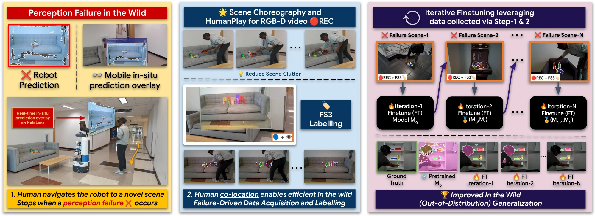
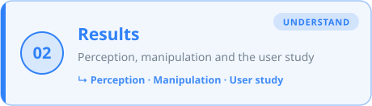
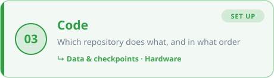
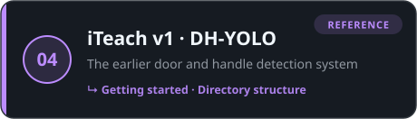
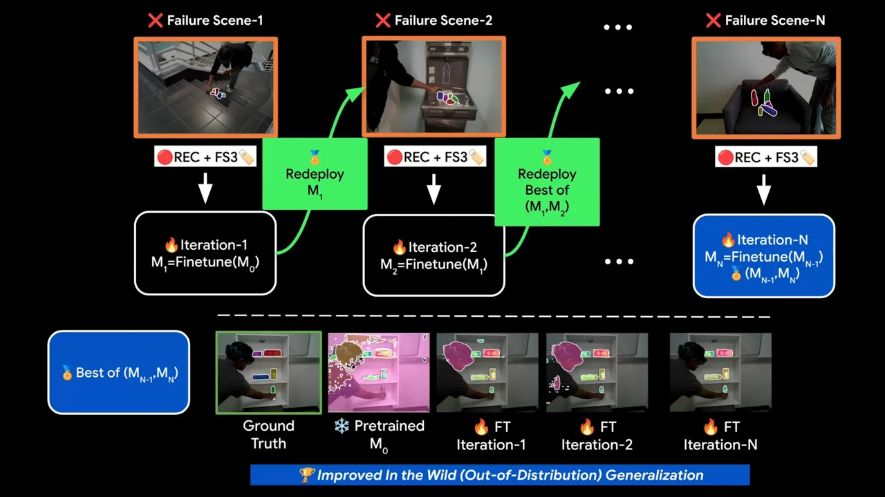
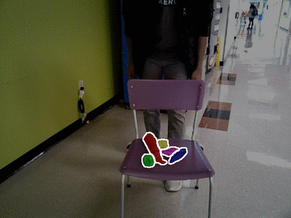
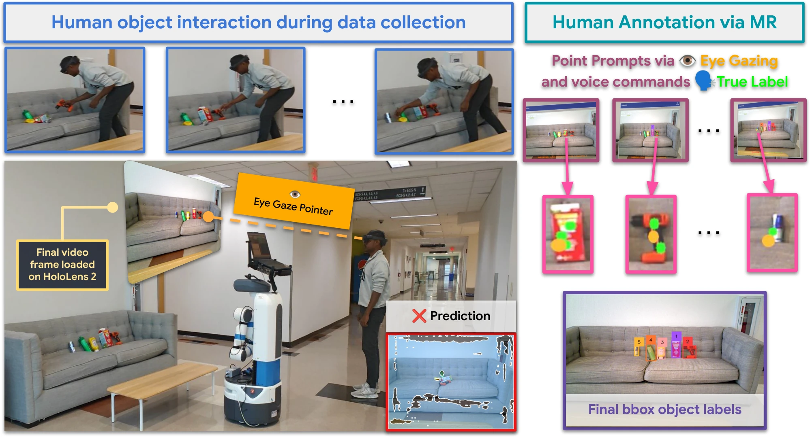
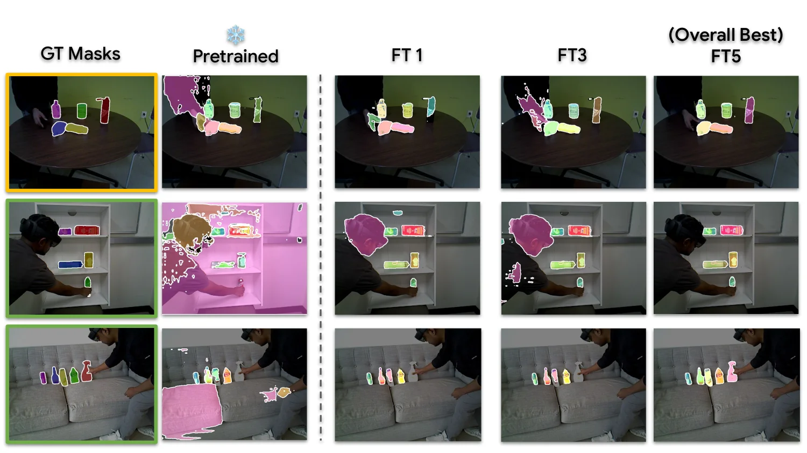
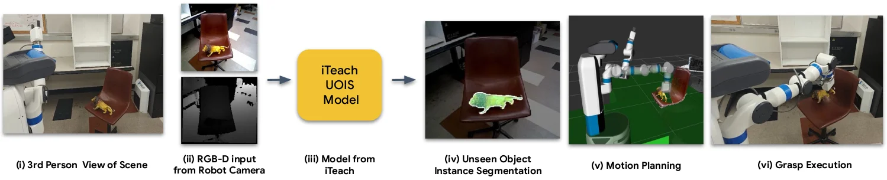

<div align="center">

# 🤖 iTeach

### In the Wild Interactive Teaching for Failure-Driven Adaptation of Robot Perception

<br>

<a href="https://jishnujayakumar.github.io">Jishnu Jaykumar P</a> &nbsp;·&nbsp;
<a href="https://labs.utdallas.edu/irvl/people/">Cole Salvato</a> &nbsp;·&nbsp;
<a href="https://labs.utdallas.edu/irvl/people/">Vinaya Bomnale</a> &nbsp;·&nbsp;
<a href="https://jwroboticsvision.github.io/">Jikai Wang</a> &nbsp;·&nbsp;
<a href="https://ayush-bhardwaj.vercel.app/">Ayush Bhardwaj</a> &nbsp;·&nbsp;
<a href="https://jessekim.com/">Jin-Ryong Kim</a> &nbsp;·&nbsp;
<a href="https://yuxng.github.io/">Yu Xiang</a>

<sub>Intelligent Robotics and Vision Lab · The University of Texas at Dallas</sub>

<br><br>

[](https://irvlutd.github.io/iTeach/)
[](https://arxiv.org/abs/2410.09072)
[](LICENSE)
[](https://www.youtube.com/watch?v=J380k96szSM)
[-ffcc4d?style=for-the-badge)](https://huggingface.co/spaces/IRVLUTD/DH-YOLO)

<br>


<br>
<sub><i>A pretrained perception model fails in the wild. A co-located human performs a short HumanPlay, annotates a single frame with eye-gaze + voice, and the label is propagated across the RGB-D clip. Failure-driven samples feed an iterative fine-tuning loop, and the best checkpoint is redeployed.</i></sub>

</div>

<br>

**iTeach** adapts robot perception **while the robot is deployed**, triggered by its failures, instead of through offline retraining.

When the perception model fails, a human spends a few seconds rearranging the objects (**HumanPlay**, 5–10 s) while the robot records RGB-D. The human then labels the final frame **hands-free with eye-gaze and voice** on a HoloLens 2. **SAM2** turns those point prompts into masks and propagates them backwards through the clip, producing dense supervision. That data is used to iteratively fine-tune an **MSMFormer** unseen-object instance segmentation (UOIS) model, which in turn improves grasping and pick-and-place.

<br>

<div align="center">

| 🎯 UOIS combined score | 🦾 Grasping success | 📦 Pick & place success | 👥 User study |
|:-:|:-:|:-:|:-:|
| **26.1 → 80.7**<br><sub>+54.6 · 3.1× lift</sub> | **71 → 74** / 100<br><sub>+3 on SceneReplica</sub> | **65 → 72** / 100<br><sub>+7 on SceneReplica</sub> | **94.9%** mean box IoU<br><sub>NASA-TLX 21/100 · 12 participants</sub> |

</div>

<br>

## 📑 Contents

<p align="center">
<a href="#-how-it-works"></a>
<a href="#-results"></a>
<a href="#-code"></a>
<a href="#️-legacy-archived-iteach-v1--door--handle-detection"></a>
<a href="#-license"></a>
</p>

<details>
<summary><b>🗂️ Full index</b> <sub>(every section and subsection as text links)</sub></summary>
<br>

<ol>
  <li><a href="#-how-it-works"><b>How It Works</b></a> · The overview video and the FS3 labelling steps</li>
  <li><a href="#-results"><b>Results</b></a> · Perception, manipulation and the user study
    <ul>
    <li><a href="#-perception-adaptation">Perception</a></li>
    <li><a href="#-manipulation-follows">Manipulation</a></li>
    <li><a href="#-who-can-teach--12-participant-user-study">User study</a></li>
    </ul>
  </li>
  <li><a href="#-code"><b>Code</b></a> · Which repository does what, and in what order
    <ul>
    <li><a href="#-data--checkpoints">Data & checkpoints</a></li>
    <li><a href="#️-hardware">Hardware</a></li>
    </ul>
  </li>
  <li><a href="#️-legacy-archived-iteach-v1--door--handle-detection"><b>Legacy · iTeach v1</b></a> · Archived door and handle detection (DH-YOLO)
    <ul>
    <li><a href="#-getting-started-in-3-steps">Getting started</a></li>
    <li><a href="#-directory-structure">Directory structure</a></li>
    </ul>
  </li>
  <li><a href="#-license">License</a> · <a href="#-citation">Citation</a> · <a href="#-contact">Contact</a> · <a href="#-acknowledgements">Thanks</a></li>
</ol>

</details>

<br>

---

<br>

## 🎬 How It Works

<p align="center">
  <a href="https://www.youtube.com/watch?v=J380k96szSM">
    
  </a>
  <br>
  <sub>▶ <b><a href="https://www.youtube.com/watch?v=J380k96szSM">Watch the overview video</a></b></sub>
</p>

<br>

Labelling uses **FS3 (Few-Shot Semi-Supervised)**: one human-labelled frame becomes dense supervision for the whole clip.

<br>

**① HumanPlay: clean up the scene**

<p align="center">
  
  <br>
  <sub><i>The human rearranges objects to reduce occlusion and produce a clean final frame while a short 5–10 s RGB-D sequence is recorded.</i></sub>
</p>

<br>

**② Annotate hands-free: eye-gaze + voice**

<p align="center">
  
  <br>
  <sub><i>Eye-gaze places point prompts on the final frame; a voice command triggers SAM2 to convert them into bounding-box object labels.</i></sub>
</p>

<br>

**③ Propagate: SAM2 video mode**

<p align="center">
  
  <br>
  <sub><i>SAM2 propagates masks backwards from the final annotated frame to all earlier frames, producing dense per-frame supervision.</i></sub>
</p>

<br>

<div align="right"><sub><a href="#-contents">⬆ back to contents</a></sub></div>

---

<br>

## 📈 Results

<p align="center"><b>Perception improves · Manipulation follows · Anyone can teach</b></p>

<br>

### 🎯 Perception adaptation

<div align="center">

| UOIS combined score | Before | After | Gain |
|:--|:-:|:-:|:-:|
| MSMFormer → iTeach fine-tuned | 26.1 | **80.7** | **+54.6** · **3.1×** |

</div>

<p align="center">
  
  <br>
  <sub><i>Qualitative UOIS. Left → right: ground truth, pretrained MSMFormer, and iTeach fine-tuning rounds FT1, FT3, FT5. iTeach recovers missed instances and cleans up over-segmentation across tabletops, shelves, sofas, stairs and floor-level scenes.</i></sub>
</p>

<br>

### 🦾 Manipulation follows

<div align="center">

| Success / 100 (SceneReplica) | Prior best (MSMFormer) | iTeach-UOIS | Gain |
|:--|:-:|:-:|:-:|
| 🦾 Grasping | 71 | **74** | **+3** |
| 📦 Pick & place | 65 | **72** | **+7** |

</div>

<p align="center">
  
  <br>
  <sub><i>Only the segmentation stage changes; everything else is held fixed. Swap in iTeach-UOIS and the same real-robot pipeline (<a href="https://github.com/IRVLUTD/SceneReplica">SceneReplica</a>: UOIS → <a href="https://github.com/IRVLUTD/contact_graspnet">Contact-GraspNet</a> grasps → <a href="https://github.com/IRVLUTD/GraspTrajOpt">GTO</a> motion planning) starts handling clutter and unseen objects the pretrained baseline fails on. <a href="https://github.com/IRVLUTD/iTeach-UOIS#-grasping--pick-and-place-scenereplica">How to run →</a></i></sub>
</p>

<br>

### 👥 Who can teach? · 12-participant user study

<div align="center">

| 👥 Participants | ✍️ Annotations | 🎯 Mean box IoU | 🧠 NASA-TLX |
|:-:|:-:|:-:|:-:|
| **12**<br><sub>6 expert · 6 non-expert</sub> | **240**<br><sub>12 people × 20 objects</sub> | **94.9%**<br><sub>SD 0.49 · gaze + voice prompts</sub> | **21 / 100**<br><sub>low task load</sub> |

</div>

<sub>Each participant ran one full teaching interaction unassisted: spot the failure in the headset, perform HumanPlay, then label the final frame with gaze and voice. <b>Expertise made no difference on any measure.</b></sub>

<br>

<div align="right"><sub><a href="#-contents">⬆ back to contents</a></sub></div>

---

<br>

## 🧩 Code

The current iTeach system is split into **three repositories**, one per module. Follow them in this order:

<br>

<table>
  <tr>
    <th width="8%">Step</th>
    <th width="30%">Repository</th>
    <th>What it does</th>
  </tr>
  <tr>
    <td align="center"><b>1</b></td>
    <td>🥽 <a href="https://github.com/IRVLUTD/iTeachSkillsApp"><b>iTeachSkillsApp</b></a></td>
    <td>HoloLens 2 app + ROS bridge. Watch live predictions, record a HumanPlay clip, place point prompts with gaze + voice, get SAM2 boxes.</td>
  </tr>
  <tr>
    <td align="center"><b>2</b></td>
    <td>🧠 <a href="https://github.com/IRVLUTD/iTeach-UOIS"><b>iTeach-UOIS</b></a></td>
    <td>Propagate SAM2 masks backwards through the clip, fine-tune MSMFormer, evaluate on iTeach-HumanPlay, and run MSMFormer as a live ROS node.</td>
  </tr>
  <tr>
    <td align="center"><b>3</b></td>
    <td>🦾 <a href="https://github.com/IRVLUTD/SceneReplica"><b>SceneReplica</b></a> <sub>(external)</sub></td>
    <td>Grasping and pick-and-place: iTeach-UOIS segmentation → Contact-GraspNet → GTO. <a href="https://github.com/IRVLUTD/iTeach-UOIS#-grasping--pick-and-place-scenereplica">How to run →</a></td>
  </tr>
  <tr>
    <td align="center">🔧</td>
    <td>📍 <b>iTeach</b> <sub>(this repo)</sub> · <a href="./src/hololens_utils">src/hololens_utils</a></td>
    <td><b>Still used by the current system:</b> <code>HoloDevicePortal.py</code> uploads <code>ROSConnectionConfig.json</code> to the HoloLens, plus the hl2ss streaming helpers. The network setup is documented in <a href="https://github.com/IRVLUTD/iTeachSkillsApp#-network-setup">iTeachSkillsApp</a>.</td>
  </tr>
</table>

<br>

> [!CAUTION]
> **Vital HoloLens step:** before each new setup, upload **`ROSConnectionConfig.json`** (with `RosIPAddress` set to your robot) to the HoloLens **`LocalAppData` → `iTechDemo_…` → `LocalState`** folder through the **Windows Device Portal** web tool. Otherwise the app cannot reach ROS. [Step-by-step guide →](https://github.com/IRVLUTD/iTeachSkillsApp#-point-the-app-at-your-ros-server)

> [!TIP]
> **Setting up the whole system?** Start with the [system diagram and five-terminal setup](https://github.com/IRVLUTD/iTeachSkillsApp#-system-overview) in iTeachSkillsApp. It covers the ROS topics, the voice commands, and how to point the HoloLens at your robot with `ROSConnectionConfig.json`.

<br>

### 📦 Data & Checkpoints

<sub>All hosted on UTD Box.</sub>

| | D5 · 5 controlled scenes | D40 · 40 scenes | Test · 902 samples |
|:--|:-:|:-:|:-:|
| **iTeach-HumanPlay dataset** | [Download](https://utdallas.box.com/v/iTeach-HumanPlay-D5) | [Download](https://utdallas.box.com/v/iTeach-HumanPlay-D40) | [Download](https://utdallas.box.com/v/iTeach-HumanPlay-Test) |
| **Fine-tuned MSMFormer** | [Download](https://utdallas.box.com/v/iTeach-UOIS-D5-ckpts) | [Download](https://utdallas.box.com/v/iTeach-UOIS-D40-ckpts) | – |

<br>

### 🛠️ Hardware

<p align="center">
  
  <br>
  <sub><i>Everything the system needs is in this frame: a Fetch carrying an RGB-D camera and an RTX 4090 laptop that runs inference, SAM2 and fine-tuning onboard, and a human wearing a HoloLens 2 for the live overlay and gaze + voice annotation.</i></sub>
</p>

<br>

| | |
|:--|:--|
| 🤖 **Robot** | Fetch mobile manipulator with a head RGB-D camera |
| 💻 **Compute** | Laptop with an RTX 4090 for onboard inference and fine-tuning |
| 🥽 **Mixed reality** | Microsoft HoloLens 2 |
| 🎮 **Teleoperation** | PS4 controller |
| 🌐 **Network** | Wired Ethernet + Wi-Fi hotspot |

<br>

<div align="right"><sub><a href="#-contents">⬆ back to contents</a></sub></div>

---

<br>

## 🗄️ Legacy (archived): iTeach v1 · Door & Handle Detection

> [!WARNING]
> **Archived. No longer maintained.** Everything below, and the `src/` (except `src/hololens_utils/`, which the current system still uses), `toolkit/`, `dataloader/`, `hololens_app/` and `hf_demo/` folders, covers the **earlier version** of iTeach. That version is a Mixed Reality labelling loop for door and handle detection with a YOLOv5-based model (**DH-YOLO**), the **IRVLUTD DoorHandle** dataset and the **iTeachLabeller** HoloLens app. It is kept only for reference and reproducibility. For the current system, see [Code](#-code).

<br>

<p align="center">
  
  <br>
  <sub><i>iTeach v1: Mixed Reality labelling loop for door and handle detection.</i></sub>
</p>

<br>

### 🚀 Getting started in 3 steps

**1 · Install the iTeachLabeller app on the HoloLens 2**
&nbsp;&nbsp;📱 Build it from [`hololens_app/`](./hololens_app) &nbsp;·&nbsp; 🛠️ [Install video](https://www.youtube.com/watch?v=7xFtCPSMTEk)

**2 · Set up the laptop and robot**
&nbsp;&nbsp;📚 Follow [src/README.md](./src/README.md)

**3 · Teach**
&nbsp;&nbsp;🤖 Drive the robot, collect failure samples, label them and fine-tune. &nbsp;·&nbsp; 🎬 [Real-world demo](https://www.youtube.com/watch?v=fusb4CkM_IE)

<br>

🎦 A walkthrough of the hardware, network and scripts is in [this video](https://www.youtube.com/watch?v=gJ7Is0SrNgc). Detailed steps are in its description.

<br>

### 📁 Directory structure

Each directory has its own README.

| Folder | Contents |
|:--|:--|
| 🧪 [`src/`](./src) | Main experiment files |
| 🛠️ [`toolkit/`](./toolkit) | iTeach toolkit (DH-YOLO inference) |
| 📱 [`hololens_app/`](./hololens_app) | iTeachLabeller HoloLens app source |
| 🗃️ [`dataloader/`](./dataloader) | PyTorch dataloader for the IRVLUTD DoorHandle dataset |
| 🤗 [`hf_demo/`](https://huggingface.co/spaces/IRVLUTD/DH-YOLO/tree/main) | DH-YOLO Hugging Face space (git submodule: `git submodule update --init hf_demo`, needs [git-lfs](https://git-lfs.com/)) |

<br>

<details>
<summary><b>📦 Publishing <code>toolkit</code> / <code>dataloader</code> to PyPI</b></summary>
<br>

Run these with each new build:

```bash
rm -rf build/ dist/               # also remove the corresponding .egg-info directory
python setup.py sdist bdist_wheel # bump the version in setup.py first
twine upload dist/*               # needs your PyPI token
```

</details>

<br>

<div align="right"><sub><a href="#-contents">⬆ back to contents</a></sub></div>

---

<br>

## 📜 License

Released under the [**MIT License**](LICENSE), © 2024-2026 Intelligent Robotics and Vision Lab (IRVL), The University of Texas at Dallas.

<sub>Third-party code keeps its own license: the YOLOv5 code under [`src/iTeach/yolov5/`](src/iTeach/yolov5/LICENSE) (and the YOLOv5-derived DH-YOLO code) is **AGPL-3.0**.</sub>

<br>

## 📚 Citation

If ***iTeach*** helps your research, please cite:

```bibtex
@misc{padalunkal2024iteach,
      title={iTeach: In the Wild Interactive Teaching for Failure-Driven Adaptation of Robot Perception},
      author={Jishnu Jaykumar P and Cole Salvato and Vinaya Bomnale and Jikai Wang and Ayush Bhardwaj and Jin-Ryong Kim and Yu Xiang},
      year={2026},
      eprint={2410.09072},
      archivePrefix={arXiv},
      primaryClass={cs.RO},
      url={https://arxiv.org/abs/2410.09072},
}
```

<br>

## 📬 Contact

| | |
|:--|:--|
| 💬 Questions & ideas | [Discussion forum](https://github.com/IRVLUTD/iTeach/discussions) |
| 🛠️ Bugs | [Open an issue](https://github.com/IRVLUTD/iTeach/issues) |
| 📧 Direct | [Jishnu](https://jishnujayakumar.github.io/) |

<br>

## 🙏 Acknowledgements

This work was supported by the DARPA Perceptually-enabled Task Guidance (PTG) Program under contract number HR00112220005, the Sony Research Award Program, and the National Science Foundation (NSF) under Grant No. 2346528. We thank [Sai Haneesh Allu](https://saihaneeshallu.github.io/) for his assistance with the real-world experiments.

<br>

<div align="center">
<sub>Built at the <a href="https://labs.utdallas.edu/irvl/">Intelligent Robotics and Vision Lab</a>, The University of Texas at Dallas</sub>
</div>
