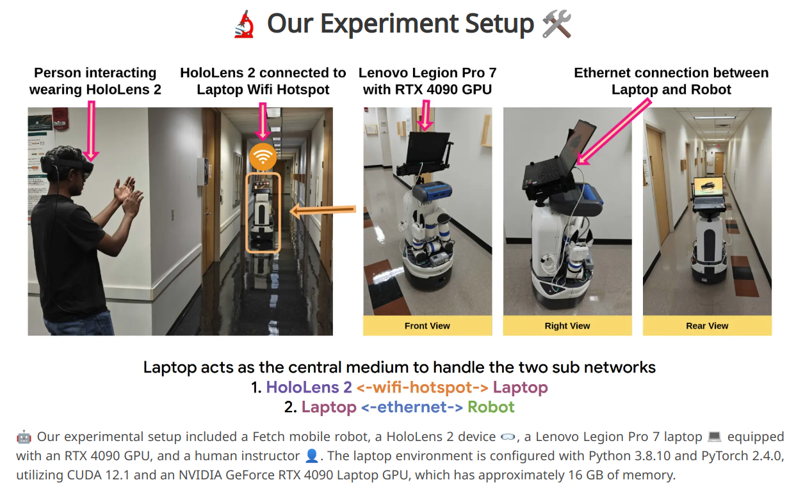
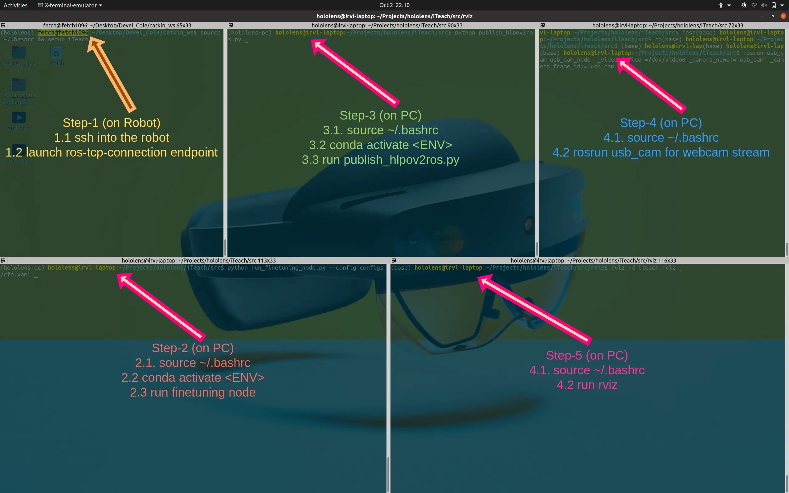

# Setup




## Streaming
#### To stream PC webcam to ROS Server
- Install `usb_cam` [[wiki](https://wiki.ros.org/usb_cam) | [github](https://github.com/ros-drivers/usb_cam)]
- Following will publish to `/usb_cam/image_raw` ROS topic
```sh
# For ros1
sudo apt install ros-<ROS-DISTRO>-usb-cam
v4l2-ctl --list-devices # list available devices; check which one is webcam
rosrun usb_cam usb_cam_node  _video_device:=/dev/video0 _camera_name:='usb_cam' _camera_frame_id:='usb_cam' # assuming /dev/video0 as the webcam
```


#### To stream hololens pov to ROS Server
1. Set env vars in `~/.bashrc` file
```
export HOLO_DEVICE_IP="10.42.0.150" # hololens ip address
export HOLO_DEVICE_USERNAME="admin" # hololens username
export HOLO_DEVICE_PASSWORD="123456789" # hololens password
```
2. Run the following command to stream the hololens pov to ROS Server
```sh
python publish_hlpov2ros.py
# This will show as follows: If IP addr is read correctly then the script is running fine given hololens device is ON
Read HoloLens IP: 10.42.0.150 from ENV
```

## Download Pretrained ckpts
```sh
wget -v -O pretrained_ckpt.pt https://utdallas.box.com/shared/static/hj1mncmm85bswn4uvbm9ytaydi7d3ws0.pt
```


```sh
## iTeach Project Setup for Robot's `~/.bashrc` 🦾

To configure the robot's environment for the iTeach HoloLens project, follow these steps:

### Step 1: Add the following to the robot's `~/.bashrc` file:

```bash
export ROS_HOSTNAME=10.42.0.233 # Place the robot's wlan IP when connected to laptop-hotspot
export ROS_MASTER_URI=http://$ROS_HOSTNAME:11311 # IP when connected to irvl-laptop hotspot
alias source_ros="source /opt/ros/$ROS_DISTRO/setup.bash"
alias source_hololens_ws="cd ~/Desktop/Devel_Cole/catkin_ws/ && source devel/setup.bash"
alias act_hololens_env="conda activate hololens"
alias start_ros_tcp_connection="roslaunch ros_tcp_endpoint endpoint.launch tcp_ip:=$ROS_HOSTNAME tcp_port:=10000"
alias setup_iTeach="source_ros && source_hololens_ws && act_hololens_env && start_ros_tcp_connection"
alias localize="roslaunch fetch_navigation fetch_nav.launch" #(auto-nav: robot localization in the map)
########################################## iTeach Project ########################################################

echo "Connected to SSID: $(iw dev wlan0 info | grep ssid | awk '{print $2}')"
echo "ROS_IP: " $ROS_IP
echo "ROS_HOSTNAME: " $ROS_HOSTNAME
echo "ROS_MASTER_URI: " $ROS_MASTER_URI
```
```sh
source ~/.bashrc && setup_iTeachPC
```

<!-- todo: setup_iTeach
setup_iTeachPC -->

## Terminator 🖥️

We recommend using the [Terminator](https://github.com/gnome-terminator/terminator) tool for managing multiple terminal windows efficiently.

Below is an example of the Terminator layout used to run all necessary modules. Ensure that the PC is connected to both the **HoloLens** and the **robot** to handle the sub-networking aspect.




# IRVL Image Labelling Support

This is a selection of files based around the testing and smooth operation of the IRVL Image Labelling project.

## Subfolders:

### [Dataset](Dataset)

In this folder one will find the labels, rgb, and 3d images of things labeled through the hololens. [receiveData.py](receiveData.py) publishes to this folder in real time and the images should already be properly formatted for a YOLO machine learning algorithm, this has been tested on [yolov5](https://github.com/ultralytics/yolov5).


## Files

## Files 📂

### [run_finetuning_node.py](run_finetuning_node.py)
This script serves as a container class that runs both `rebroadcastData` and `receiveData` in a single command, eliminating the need to open multiple terminal windows. It requires `rospy` to be installed and doesn't accept any command line arguments. 🐍

### [rebroadcastData.py](rebroadcastData.py)
This script captures output from the **Fetch robot's** head camera and rebroadcasts both the RGB and depth data at a reduced frame rate. The output topics are `InfrequentImage` and `InfrequentDepth`, both of which follow the [sensor_msgs/Image](http://docs.ros.org/en/noetic/api/sensor_msgs/html/msg/Image.html) message type. It can be run independently, requiring ROS and rospy, with no additional arguments needed. 🤖

### [receiveData.py](receiveData.py)
As described in the **Dataset** section, this script receives data from the **HoloLens** and organizes it into the corresponding directories. The incoming ROS messages include `LabeledImage`, `LabeledDepth`, and `ImageLabels`. Messages received simultaneously are assumed to belong to the same set, and the file names are formatted according to YOLO requirements. This script can also be executed independently without any command line arguments. 📥💾


### Installation

It is recommended that a Windows device is used to compile this part of the project, and has not been tested on other platforms. A Unity version newer or equivalent to a 2022 release and at least Microsoft Visual Studio 2022 are required. Due to technical constraints, this project can only run on a Hololens 2. To deploy the project after building to your local machine, follow the optional steps of [the Hololens 2 tutorial](https://learn.microsoft.com/en-us/training/modules/learn-mrtk-tutorials/1-7-exercise-hand-interaction-with-objectmanipulator) and build the project with the release version; it will lose considerable amounts of FPS when built with a debug target.

## Execution

### PC
On a linux computer, set the ROS_IP and ROS_MASTER_URI (and not ROS_HOSTNAME), then run [execsupport.py](execsupport.py). See [execsupport](#execsupportpy) for individual usage and expectations.

### Server
The server needs to be running [ROS-TCP-Endpoint](https://github.com/Unity-Technologies/ROS-TCP-Endpoint) to connect to the Hololens. See the link for installation instructions.

Once it has been setup, the commands should look approximately as follows:

```
source devel/setup.bash

rosrun ROS-TCP-Endppoint endpoint.launch tcp_ip:=<The server's ip> tcp_port:=10000
```

### Hololens
After setting the IP of the server in Unity, the project needs to be built and deployed to the hololens. Further details are provided in [Hololens Installation](#installation). Once it's deployed, just open the app from the start menu.

## Troubleshooting

### Rviz

For many of these troubleshooting steps, it is required to be able to see the images being passed through ROS. Rviz is recommended for this.

### PC is not receiving images from the server

Check the ROS_IP and ROS_MASTER_URI environment variables on both the server and the PC.

### Hololens is not receiving images

Firstly, check that execsupport is running. If the server is receiving processed images then check that the endpoint launched properly. If both of these are true, check that the ip is set correctly in the Hololens.

### PC is not receiving relabeled images & labels

In this case, it's likely that the PC or server's ROS_HOSTNAME is set to a non-null value. Set these to ```0.0.0.0```.

### OMP: Error #15: Initializing libiomp5md.dll, but found libiomp5md.dll already initialized.

This error might show up in run_finetuning_node.py & receiveData.py. In a terminal in the environment that the program is running in run:

```conda install nomkl --channel conda-forge```

After this, check that all package requirements are still installed. This solution courtesy of [postylem](https://stackoverflow.com/questions/20554074/sklearn-omp-error-15-initializing-libiomp5md-dll-but-found-mk2iomp5md-dll-a).
